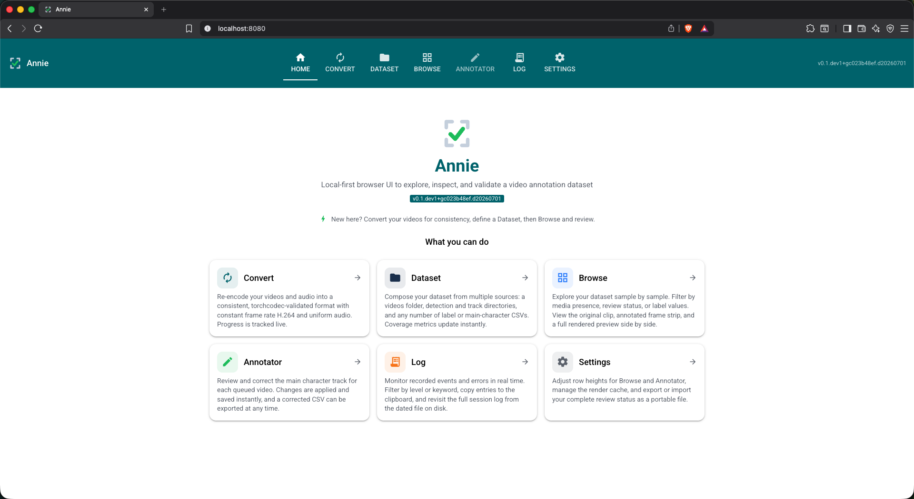
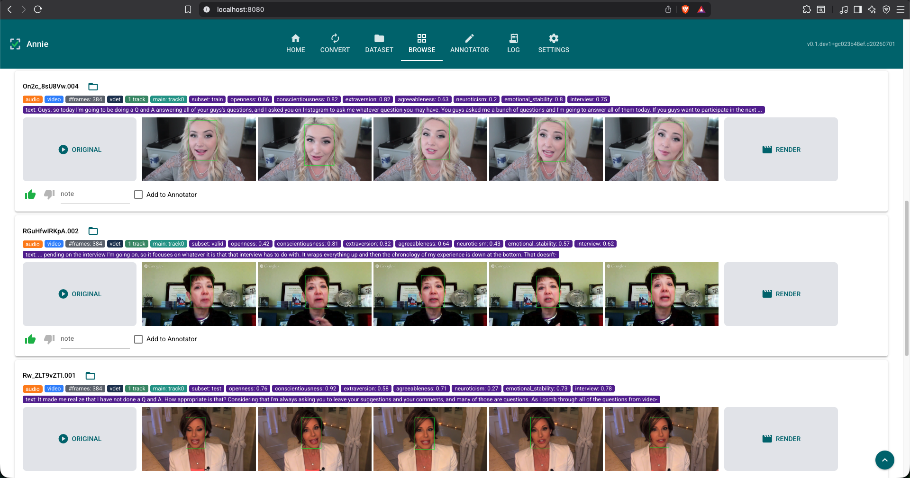

<div align="center">


<br/>

**Local-first browser UI to explore, inspect, and validate a video annotation dataset**

[](https://github.com/fodorad/Annie/releases)
[](https://pypi.org/project/annie/)
[](https://github.com/fodorad/Annie/actions)
[](https://codecov.io/gh/fodorad/Annie)
[](https://fodorad.github.io/Annie/)
<br/>
[](https://www.python.org)
[](https://github.com/astral-sh/ruff)
[](LICENSE)

</div>

---

Annie visualizes a video dataset alongside its frame-wise annotations and lets you
curate and (soon) author them — all in one local, browser-based UI that runs on a
single machine. The motivating datasets are **CMU-MOSEI** and **First Impression V2** (face detections + derived
face tracks), but Annie is dataset-agnostic.

## Screenshots



*Home tab — landing page with a summary card for each tab.*



*Browse tab — per-video rows with original clip, annotated frame strip, label tags, and review controls.*

## Features

| Tab | What it does |
|---|---|
| **Home** | A landing page (the default) summarising each tab; click a card to jump there. |
| **Convert** | Re-encode an audio/video dataset to a consistent, **torchcodec-validated** form: uniform audio (format/rate/channels) and constant-frame-rate H.264 video, with explicit audio muxing (or black-frame videos for audio-only). A background batch shows live `X/Y` progress, %, elapsed, and ETA. |
| **Dataset** | Build the dataset from a list of **data sources** (videos folder, vdet/track folders, and any number of label/main-character CSVs). Add a source and it scans in place — no Scan button — with live counts and an Available/Unavailable chip per source. |
| **Browse** | Scrollable, per-video visualizer with an always-visible **filter bar** (name, video/audio/vdet/track presence, review, labels): an ORIGINAL placeholder, five-frame strip, on-the-fly annotated render, media/annotation/label tags, and per-video review (liked by default, dislike, note, "Add to Annotator"). Row height is configurable. |
| **Annotator** | Greys out until videos are queued from Browse; then shows only those, in taller rows, to fix the **main-character track** — pick a track, see it re-render green, **Save**, and export the corrected datasource as CSV. |
| **Settings** | Browse/Annotator row height, render-cache TTL, and review-status export/import (CSV/JSON). |

### Highlights

- **Extensible data sources** — a dataset is an ordered set of sources; a CSV joins
  to videos by a chosen key column, exposing its value columns as Browse tags and
  filter facets (e.g. `Sentiment: negative`, `Angry: 0.33`). Dataset-agnostic by
  construction.
- **Stem matching** — videos pair with vdet/track files by filename stem (exact +
  prefix, longest-stem-first), aggregated into **one row per video**.
- **Composable filtering** — filter by vdet/track coverage, review verdict, notes,
  annotator selection, and label values; facets combine with AND, label values OR.
- **Frame-accurate decode** — [torchcodec](https://github.com/meta-pytorch/torchcodec)
  with `exact` mode for the annotator and `approximate` for fast scrubbing.
- **Render-on-demand** — a background job burns annotations into a browser-playable
  clip (libx264 via FFmpeg, audio muxed back); temp clips auto-purge on a TTL.
- **Main-character correction** — pick the true main character; the fix is written
  to a separate `_manual` file (resolution `manual ▸ source ▸ -1`) so human
  judgement never overwrites the pristine heuristic record, and the resolved
  datasource exports to a standalone CSV.

## Installation

### Prerequisites

Required for the **source** and **PyPI** install paths. Docker bundles everything automatically.

| Tool | Purpose | Install |
|---|---|---|
| [uv](https://docs.astral.sh/uv/) | Python package manager | `curl -LsSf https://astral.sh/uv/install.sh \| sh` |
| [FFmpeg](https://ffmpeg.org/) (4–8) | Frame decode, render pipeline, audio probe | `brew install ffmpeg` |
| ffprobe | Audio-stream detection (ships with FFmpeg) | included with FFmpeg |

### From PyPI

```bash
uv pip install "annie[all]"     # core + torch / torchcodec for frame decode & render
annie                           # starts the UI at http://127.0.0.1:8080
```

### From source (development)

```bash
git clone https://github.com/fodorad/Annie
cd Annie
make dev      # installs annie[all,dev] in editable mode (torch + torchcodec included)
make run      # starts the UI at http://127.0.0.1:8080
```

### Docker

No Python, uv, or FFmpeg required on the host — Docker bundles everything.

```bash
git clone https://github.com/fodorad/Annie
cd Annie
cp .env.example .env   # fill in your HDD paths
make docker-build      # ~5–10 min first time (downloads CPU torch)
make docker-run        # starts the UI at http://localhost:8080
```

Or pull the pre-built image without cloning:

```bash
curl -O https://raw.githubusercontent.com/fodorad/Annie/main/docker-compose.yml
curl -O https://raw.githubusercontent.com/fodorad/Annie/main/.env.example
cp .env.example .env   # fill in your HDD paths
docker compose up      # pulls fodorad/annie:latest automatically
```

Annie state (logs, session DBs, render cache, saved configs) is stored in
`./annie-home/` next to `docker-compose.yml` by default, so all files are
directly accessible from Finder / Explorer. Exported review CSVs land in
`annie-home/tmp/`. Override the path with `ANNIE_HOME_HOST` in `.env`.

> **macOS + external HDDs:** If `/Volumes` is already in Docker Desktop →
> Settings → Resources → File Sharing, individual drives under `/Volumes`
> work without any additional configuration.

### Extras

| Extra | What it adds |
|---|---|
| `media` | torch, torchcodec — frame decoding & rendering |
| `dev` | ruff, ty, coverage, pre-commit |
| `docs` | sphinx, furo, sphinx-autoapi, myst-parser |
| `all` | `media` |

## Architecture

Annie is a single process with a strict **layered architecture**; each layer calls
only the layer directly beneath it, enforced by import direction:

```
UI layer          annie/app.py, annie/pages/*          (NiceGUI tabs)
   │  calls down only
Service layer     annie/dataset/*, annie/media/*        (scanning, rendering, filtering, …)
   │
Domain layer      annie/core/models.py, annie/parsers/* (pure data, no I/O frameworks)
   │
Infrastructure    annie/core/config.py, annie/core/theme.py,
                  annie/dataset/storage.py (SQLite), annie/media/decode.py (torchcodec)
```

The UI never imports `sqlite3` or `torchcodec` directly — it calls a service
function. The core layers install without a heavyweight torch dependency; only the
frame decode and render pipeline need the `media` extra.

## Annotation formats

Both `.vdet` and `.track` files share one 17-column CSV schema (CRLF, with header):

```
frame_id, source, score, x, y, w, h,
left_eye_x, left_eye_y, right_eye_x, right_eye_y,
nose_x, nose_y, left_mouth_x, left_mouth_y, right_mouth_x, right_mouth_y
```

- **`.vdet`** — all raw detections for a video; may have several rows per frame.
- **`{video_id}__track{N}.csv`** — one tracked face across frames (one row/frame).
- **main-character CSV** — e.g. `participant_face_track_heuristic.csv` with
  `uuid,track_id`, the active main character per video (`-1` = none). The key and
  track-id columns are chosen when the source is added; manual corrections go to
  the `_manual` sibling.
- **label CSV** — any CSV; pick a key column (joined to the video id) and value
  columns to surface as Browse tags and filter facets.

## Development

```bash
git clone https://github.com/fodorad/Annie
cd Annie
make dev      # install in editable mode with all extras
make check    # lint + type-check + test + docs (mirrors CI)
make run      # start the app at http://127.0.0.1:8080
```

**Tip — skip re-clicking paths on every restart:** set `ANNIE_*` environment
variables and Annie will seed those sources automatically at launch. This is
equivalent to manually adding sources on the Dataset tab, but saves time during
development when you always work with the same dataset.

```bash
export ANNIE_VIDEOS_DIR=/path/to/videos
export ANNIE_VDET_DIR=/path/to/vdets
export ANNIE_TRACK_DIR=/path/to/tracks
export ANNIE_PARTICIPANTS_FILE=/path/to/participant_face_track_heuristic.csv
make run
```

Sources seeded via env vars are session-only; curation and corrections always
persist. Save your source configuration from the Dataset tab to a named config
file to reload it in one click without relying on env vars. Every setting has a
corresponding `ANNIE_*` variable (see `annie/core/config.py`).

See [CONTRIBUTING.md](CONTRIBUTING.md) for the commit convention and release flow.

## Documentation

- [API Reference](https://fodorad.github.io/Annie/)

## Related Projects

- **[exordium](https://github.com/fodorad/exordium)** — multimodal feature extraction (the detectors/trackers that produce Annie's `.vdet`/`.track` inputs).

## Contact

**Ádám Fodor** — [adamfodor.com](https://adamfodor.com) · fodorad201@gmail.com

## License

[MIT](LICENSE)
