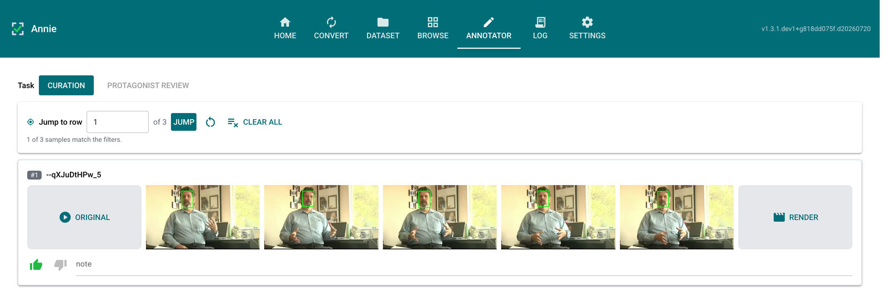

Annie
=====

A **local-first**, browser-based tool to explore, inspect, and validate a video
annotation dataset alongside its frame-wise annotations. The motivating datasets
are **CMU-MOSEI** and **First Impression V2** (face detections and derived face
tracks), but Annie is dataset-agnostic.

.. toctree::
   :maxdepth: 2
   :caption: Contents

   playbooks/index
   autoapi/index

Highlights
----------

- **Convert tab** — re-encode an audio/video dataset to a consistent,
  torchcodec-validated form (uniform audio, constant-frame-rate H.264) with a live
  batch-progress readout.
- **Dataset tab** — build a dataset from an ordered set of **data sources** (videos
  folder, vdet/track folders, and any number of label/protagonist CSVs); each
  source scans in place — no Scan button — with live counts and per-source
  availability.
- **Browse tab** — a scrollable, **one-row-per-video** visualizer with a filter
  bar: thumbnail, five-frame strip, on-the-fly annotated render, and label tags. It
  is a **read-only viewer**; clicking a row *selects* it (a check tick) for the
  Annotator rather than recording supervision.
- **Annotator tab** — the supervision surface, offering only the tasks whose sources
  are present: **Protagonist review** (correct the active track), **Curation**
  (like/dislike/note), and **Segment review** (accept/drop per-clip segments of long
  videos, comparing competing start/end bands, exported as two files). See the
  :doc:`playbooks/index`.
- **Settings tab** — row height, render-cache controls, and review-status
  export/import.

See the :doc:`playbooks/index` for screen-by-screen walkthroughs of the main flows.

Screenshots
-----------

.. figure:: ui/home.png
   :width: 100%
   :alt: Annie – Home tab

   Home tab — landing page with a summary card for each tab.

.. figure:: ui/browse.png
   :width: 100%
   :alt: Annie – Browse tab

   Browse tab — per-video rows with original clip, annotated frame strip, and label tags,
   above collapsible Manipulate / Filter / View panels. Click a row's top-right corner to
   queue it for the Annotator.

   Annotator tab — where supervision is entered, one task at a time. The task switch
   offers only the tasks your sources support: Curation (shown), Protagonist review, and
   Segment review.

Architecture
------------

Annie is a single process with a strict **layered architecture**; each layer calls
only the layer directly beneath it:

.. code-block:: text

   UI layer          annie/app.py, annie/pages/*          (NiceGUI tabs)
      │  calls down only
   Service layer     annie/dataset/*, annie/media/*        (scanning, rendering, filtering, …)
      │
   Domain layer      annie/core/models.py, annie/parsers/* (pure data, no I/O frameworks)
      │
   Infrastructure    annie/core/config.py, annie/core/theme.py,
                     annie/dataset/storage.py (SQLite), annie/media/decode.py (torchcodec)

The UI never imports ``sqlite3`` or ``torchcodec`` directly — it calls a service
function. This is what keeps the pieces swappable.

Installation
------------

.. code-block:: bash

   uv pip install annie            # core: scanning, parsing, matching, storage, UI
   uv pip install "annie[all]"     # + torch / torchcodec for frame decode & render

The ``media`` extra (pulled in by ``all``) also requires a system **FFmpeg**
(versions 4–8), which backs both the decoder and the render pipeline. To run
without installing Python, uv, or FFmpeg on the host, use the Docker image — see
the `README <https://github.com/fodorad/Annie#docker>`_ for the compose setup and
how dataset directories and persistent state are mounted.

Quick start
-----------

.. code-block:: bash

   export ANNIE_VIDEO_DIR=/path/to/video
   export ANNIE_VDET_DIR=/path/to/vdet
   export ANNIE_TRACK_DIR=/path/to/track
   export ANNIE_PROTAGONIST_CSV=/path/to/protagonist_track_heuristic.csv
   export ANNIE_LABEL_CSV=/path/to/label.csv
   annie                             # opens http://127.0.0.1:8080

Every setting has a matching ``ANNIE_*`` variable (see :mod:`annie.core.config`);
sources seeded this way are session-only, while curation and corrections always
persist. Saved configs, session databases, logs, and render/export files live
under ``ANNIE_HOME`` (``~/.annie`` by default).

Data model
----------

- Videos and annotations are matched by **stem** (filename minus extension), with
  exact-stem and prefix matching, resolved longest-stem-first.
- A ``.vdet`` holds all raw detections (possibly several faces per frame); a
  ``__track{N}.csv`` follows one face across frames.
- Each video is aggregated into **one Browse row** carrying its ``.vdet`` and all
  of its tracks — not a per-file fan-out.
- The active "protagonist" track resolves **manual ▸ source ▸ -1**; manual
  corrections are written to ``participant_face_track_heuristic_manual.csv`` and
  never overwrite the pristine heuristic file.

Development
-----------

.. code-block:: bash

   git clone https://github.com/fodorad/Annie
   cd Annie
   uv pip install -e ".[all,dev,docs]"
   make check   # lint + type-check + test + docs

Contact
-------

**Ádám Fodor** — `adamfodor.com <https://adamfodor.com>`_ · fodorad201@gmail.com
