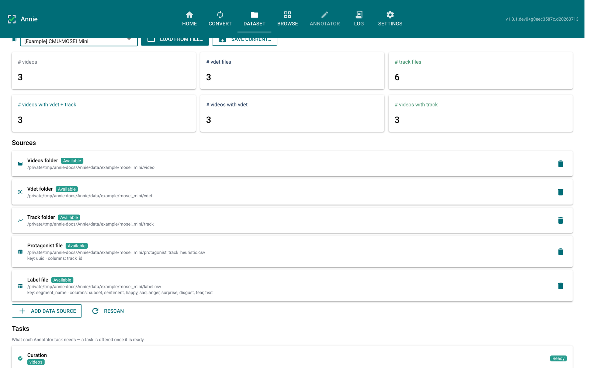
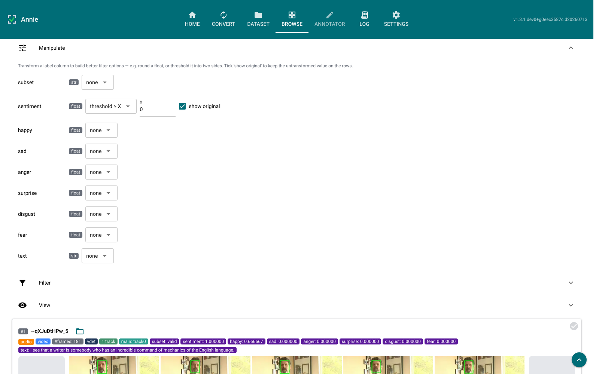
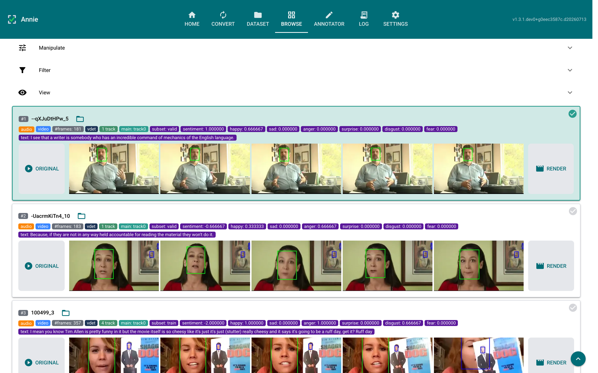
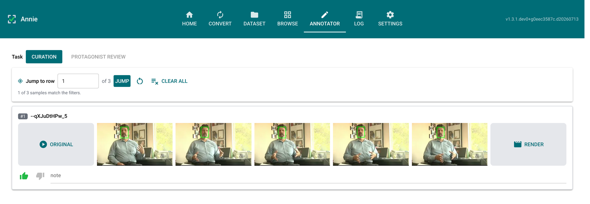

# Playbook — Dataset, Browse & Curation

This playbook follows a reviewer from **defining** a dataset, through **finding** the
interesting samples in Browse, to **supervising** them in the Annotator. It reflects the
separation Annie enforces: Browse is a read-only viewer that only *selects*; all
supervision (verdicts, notes, protagonist corrections) happens in the Annotator.

Every screenshot below is the real UI, captured against the bundled
`[Example] CMU-MOSEI Mini` config — so you can reproduce each screen by picking that
config from the Dataset tab.

---

## Step 1 — Define the dataset on the Dataset tab

A dataset is an ordered list of **data sources**, not a fixed set of folders. Pick a
config from the selector (or build one with **Add data source**); adding or removing a
source re-scans in place, so the metrics update immediately.

What to notice:

- **Metric cards** summarise the scan: videos, vdet files, track files, and how many
  videos have each annotation.
- Each **source card** shows an Available / Unavailable chip and, for CSVs, the key
  column and the value columns it contributes.
- The **Tasks** panel below (scrolled off here) lists what each Annotator task needs and
  whether it is *Ready* — a task is offered in the Annotator exactly when it is ready
  here.
- **Persistence** pins the review database. A saved config owns an `annie_<name>.db`
  under `ANNIE_HOME`, so reloading the config reopens the same decisions.

---

## Step 2 — Reshape label columns with Manipulate

Raw label columns are not always the ones you want to filter on. The **Manipulate**
panel derives a filterable view of a column without touching the underlying data — round
a float, or threshold it into two sides.

What to notice:

- Each row is `column · type · transform`, with the detected type as a badge. The
  available transforms depend on that type.
- Here `sentiment` (a float in `[-3, 3]`) is set to **threshold ≥ X** with `X = 0`,
  turning a continuous column into a clean two-way filter facet.
- **show original** keeps the *untransformed* value on the sample rows — note the row
  below still reads `sentiment: 1.000000`. The transform drives the **filter**; this
  checkbox decides only what is **displayed**, so you can filter on `≥ 0` and still read
  the real number.
- **Manipulate**, **Filter**, and **View** form one accordion — opening one closes the
  others, so the sample rows are never pushed off screen.

---

## Step 3 — Select the samples you want to supervise

Browse lists one row per video. Clicking the **top-right corner** of a row selects it for
the Annotator; nothing else on the row toggles selection, so playing a video or opening
the reveal menu never queues it by accident.

What to notice:

- The **selected** row (#1) carries a teal border, a lighter teal fill, and a solid ✓ in
  its corner. The unselected rows show a **faint** tick — the affordance that says
  "click here" — which brightens on hover.
- Browse carries **no** like/dislike or note controls. The only state a click writes is
  *"queued for the Annotator."*
- Each row shows its label tags, a lazy **ORIGINAL** placeholder that embeds the video on
  click, the five-frame strip with the protagonist track boxed in green, and a
  **RENDER** box.
- The verdict / note **filters** remain, so you can still narrow by curation gathered
  elsewhere; Browse just no longer *sets* it.
- **Add all filtered to Annotator** queues the whole filtered list in one click.

---

## Step 4 — Curate the queued videos in the Annotator

Switch to the Annotator and pick the **Curation** task. It shows the queued videos with
the like/dislike verdict and a free-text note — the supervision that used to live on
Browse rows. Every video is liked by default until you disagree; each change saves to the
review database immediately.

What to notice:

- Each row mirrors a Browse row — ORIGINAL, five frames, RENDER — at a slightly smaller
  scale, leaving room for the review controls beneath it.
- **Task** at the top offers only the *ready* tasks. Here that is Curation and
  Protagonist review; Segment review is absent because this config has no segmentation
  CSV.
- The toolbar carries **Jump to row**, a reset, and **Clear all** — the dataset-wide
  actions, kept together and away from the per-row controls.

Which tasks appear is driven by the sources present on the Dataset tab:

- **Curation** — needs only a videos folder.
- **Protagonist review** — needs a protagonist CSV.
- **Segment review** — needs a segmentation CSV (see the
  [Segment-review playbook](segment-review.md)).

---

## Why the split

Keeping Browse read-only and consolidating supervision under the Annotator means each
sample's judgements have a single home (the review database), and a reviewer always
knows which surface *collects* input versus which one just *presents* it. Selection is
routing, not supervision — so it stays in Browse.

---

## Where this lives in the code

| Concern | Module |
|---|---|
| Source registry, task readiness | {mod}`annie.dataset.sources` |
| Config save/load, per-config database | {mod}`annie.dataset.datasets` |
| Label transforms (round, threshold) | {mod}`annie.dataset.manipulate` |
| Filter predicates | {mod}`annie.dataset.filtering` |
| Read-only rows + corner selection | `annie.pages.browse` |
| Task switch, Curation task | `annie.pages.annotator` |
| Verdict / note / selection persistence | {mod}`annie.dataset.storage` |
