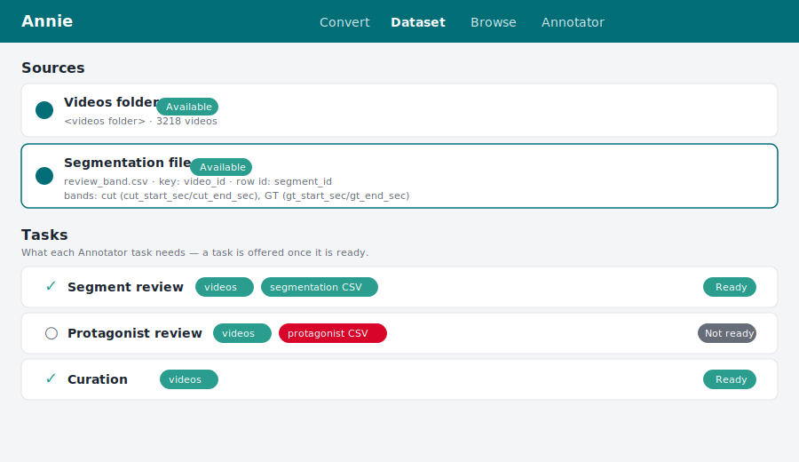
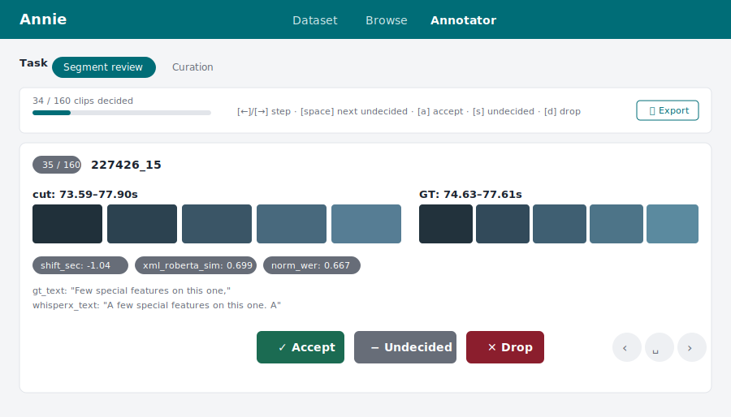

# Playbook — Segment review (accept / drop clips)

This playbook walks through the **Segment-review** task end to end, so the expected flow
is clear without running Annie. Use it when a long video has been cut into per-clip
segments (each a span of the video) that must be individually checked and kept or
discarded — for example validating a WhisperX forced-alignment against a ground-truth
segmentation.

The motivating file is `review_band.csv`: one row per clip, identified by `video_id` +
`segment_id`, carrying two competing start/end **bands** (a `cut` prediction and a `GT`
reference) plus per-clip metrics and transcripts.

```{note}
The bundled example configs have no segmentation source yet, so the screens below are
mockups rather than captures. The other playbook's screenshots are the real UI.
```

---

## Step 1 — Declare the segmentation source on the Dataset tab

Add the segmentation CSV as a data source and pick the **Segmentation** role. The role
*is* the task declaration: choosing it turns on the segment mapping controls (the row id
column and the start/end bands) and makes the **Segment review** task appear as *Ready*
below.



What to notice:

- **Key column** joins to the video id — this is the only link between a row and its
  video. The video itself is found in the scanned videos folder, so the CSV never carries
  a path.
- **Row id column** is what tells apart the many rows that share one video id. It
  combines with the key into the clip identity `{video_id}_{segment_id}` (e.g.
  `227426_15`) that each accept/drop is stored under. Pick a column that is unique within
  a video.
- **Bands** are named start/end column pairs. Add one per competing segmentation — here
  `cut` (`cut_start_sec`/`cut_end_sec`) and `GT` (`gt_start_sec`/`gt_end_sec`).
- **Value columns** become the read-only tags shown on each clip; tick `segment_id` here
  if you want the segment id visible on the card.
- The **Tasks** panel shows, per task, which sources it needs and whether it is *Ready*.
  Segment review is ready as soon as the videos folder and the segmentation CSV exist.

---

## Step 2 — Open the Annotator and pick the Segment-review task

The Annotator is the single supervision surface; a task switch at the top offers only the
*ready* tasks. Selecting **Segment review** shows one clip at a time.



What to notice:

- A single **toolbar** across the top carries the decision progress (`34 / 160 clips
  decided`), the keyboard legend, and **Export** — all on one line, always open.
- The clip's **tags** (metrics, `gt_text`, `whisperx_text`) sit at the top of the card, so
  the sample reads big; then a lazy **ORIGINAL** placeholder that embeds the whole source
  video on click.
- Below that, **one row per band**. Each row aligns the band's name, start, end, and
  duration as borderless table cells — so the numbers line up column-wise between bands
  and the alignment shift is visible by eye — followed by five frames sampled across that
  span and a **clip** placeholder that cuts exactly that span on demand and plays it.
- **Accept** / **Undecided** / **Drop** sit centred at the bottom. A decision saves to the
  review database immediately and paints the card with a coloured border and a lighter
  wash of the same hue: green for accepted, red for dropped.
- Deciding does **not** advance. The card stays put so you see the verdict land on the
  sample you just judged; you move on deliberately.

---

## Step 3 — Work through the clips (mouse or keyboard)

Drive the pass however is fastest:

- `←` / `→` — step to the previous / next clip without deciding.
- `space` — jump to the next clip with no decision yet, wrapping around. The matching
  button sits between the two arrows at the card's bottom right, and both go inert once
  every clip is decided.
- `a` — **Accept**, keep the clip.
- `s` — **Undecided**, clear any verdict and return the clip to the undecided pool. This
  works even on a clip already accepted or dropped, so a misclick is recoverable.
- `d` — **Drop**, discard the clip.

Each decision persists as you go, so the pass is **resumable**: close the tab, restart
Annie, reopen the same source, and every prior accept/drop is restored from the database.
The toolbar's progress bar tracks how far along the pass is.

---

## Step 4 — Export the two decision sets

Press **Export** in the toolbar. Segment review produces **two files** beside the
segmentation source:

- `review_band_accepted.csv` — the kept clips.
- `review_band_dropped.csv` — the discarded clips.

Each file carries the clip key, the `video_id` / `segment_id`, and the clip's passthrough
columns, so the accepted set is a ready-to-use keep-list and the dropped set a discard
record. Undecided clips appear in neither file.

---

## Where this lives in the code

| Concern | Module |
|---|---|
| Clip model, loader, two-file export, next-undecided search | {mod}`annie.dataset.segments` |
| Segmentation role, bands, task readiness | {mod}`annie.dataset.sources` |
| Accept/drop persistence (`decision` column) | {mod}`annie.dataset.storage` |
| The task UI, band rows, keyboard | `annie.pages.annotator` |
| Span-clipped frame decode | {func}`annie.media.preview.build_band_strip` |
| On-demand span cut for the clip box | {func}`annie.media.clipping.cut_clip` |
